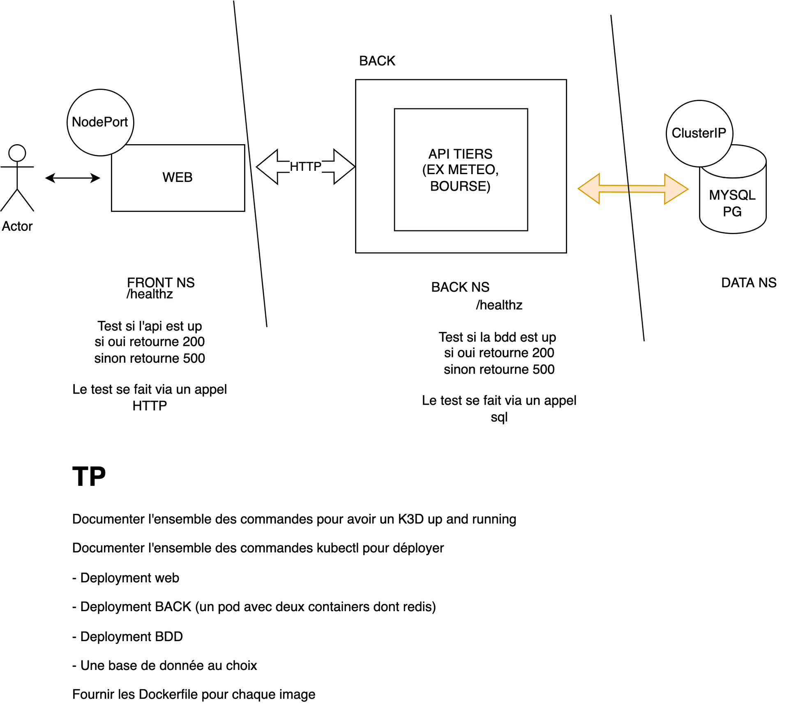

# mbo_kube_tp

## How to deploy the whole setup, hopefully easily

### Setup nodes, using k3d
```bash
k3d cluster create main-cluster --agents 2
```

Then we'll launch each section as a separate deployment.
For convenience purposes, a default secret "db-secret" is present as a file. This is not safe to use the default value of course.
Note the the secret is duplicated across namespaces.


### Launch the database
```bash
kubectl apply -f ./api/infra/1_data/
```

### Launch the backend
```bash
kubectl apply -f ./api/infra/2_back/
```

### Launch the frontend
```bash
kubectl apply -f ./front-end/infra/
```

Since I'm using k3d in this setup, we're going to manually expose the frontend via a port forward.

### Setup port forwarding
```bash
kubectl port-forward $(kubectl get pods -n next-front | tail -n 1 | cut -d ' ' -f 1) 3000:3000 -n next-front
```

Then you can head over to [you browser](http://localhost:3000) to try out the "beautiful" website

### Deleting the cluster
```bash
k3d cluster delete main-cluster
```




## Building images
All images can be built using `docker build -t <whatyouwant> .` in their respective folders:

- `/front-end` for the front end
- `/api` for the api

